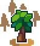
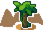

# 🌿 채집

채집 월드는 다양한 재료를 얻을 수 있는 특별한 공간입니다. 각 월드마다 얻을 수 있는 자원이 다릅니다.

### **채집월드 지도**

<figure><figcaption>
엔더 / 숲 / 지옥 / 사막
</figcaption></figure>

***

### <mark style="background-color:green;">**숲 월드**</mark>

<figure><figcaption></figcaption></figure>

잔디와 꽃을 채집할 수 있는 월드입니다.

**잔디**

* 호미를 들고 잔디를 우클릭하여 채집합니다.
* 최대 5번의 잔디 채집 후 3초의 쿨타임이 지난 후 다시 채집을 할 수 있습니다.
* 채집된 잔디는 **30초 후에 다시 생성**됩니다.
* <mark style="color:red;">동일한 위치의 잔디 블록을 연속해서 채집할 수 없습니다. 해당 위치에서 다시 채집하려면,</mark> <mark style="color:red;"></mark><mark style="color:red;">**최소 10개의 다른 잔디 를**</mark> <mark style="color:red;"></mark><mark style="color:red;">먼저 채집해야 합니다.</mark>

**<채집 가능한 아이템>**\
잔디 블록, 잔디, 당근, 독이 있는 감자, 감자, 호박씨, 백여우 가죽, 여우 가죽, 수박씨, 땅콩, 썩은 감자, 비트 씨앗, 횃불꽃 씨앗, 밀 씨앗, 통후추, 큰 흘림잎, 작은 흘림잎

**꽃**

* 호미를 들고 꽃을 우클릭하여 채집합니다.
* 꽃 채집에는 별도의 **쿨타임이 없습니다.**
* 채집으로 사라진 꽃은 **30초 뒤에 다시 생성**됩니다.
* <mark style="color:red;">잔디와 마찬가지로, 동일한 위치의 꽃을 연속해서 채집할 수 없습니다. 해당 위치에서 다시 채집하려면,</mark> <mark style="color:red;"></mark><mark style="color:red;">**최소 10개의 다른 꽃**</mark><mark style="color:red;">을 먼저 채집해야 합니다.</mark>

**<채집 가능한 아이템>**\
파란 나비, 땅강아지, 여치, 풍뎅이, 무당벌레, 라벤더, 능소화, 장미, 프리지아, 덫, 지렁이, 분홍색 튤립, 주황색 튤립, 하얀색 튤립, 빨간색 튤립, 선애기별꽃, 알리움, 파란색 난초, 양귀비, 민들레, 라일락, 해바라기, 큰고사리, 포자꽃, 분홍 꽃잎, 횃불꽃, 은방울꽃, 수레국화, 데이지, 벌레잡이풀, 모란, 장미 덤불

***

### <mark style="background-color:yellow;">**사막 월드**</mark>

<figure><figcaption></figcaption></figure>

모래를 채집할 수 있는 월드입니다.

**모래**

* 호미를 들고 모래 블록을 우클릭하여 채집합니다.
* 한 번 채집하는 데 **3초의 시간**이 소요됩니다.
* 채집된 모래 블록은 **30초 뒤에 다시 생성**됩니다.
* <mark style="color:red;">잔디/꽃과 동일하게, 한 위치의 모래 블록을 연속해서 채집할 수 없습니다. 해당 위치에서 다시 채집하려면,</mark> <mark style="color:red;"></mark><mark style="color:red;">**최소 10개의 다른 모래 블록**</mark><mark style="color:red;">을 먼저 채집해야 합니다.</mark>

**<채집 가능한 아이템>**\
모래, 바지락, 고동, 굴, 전복, 뿔소라, 가리비, 암모나이트 화석, 떡밥, 오래된 루어 박스, 루어 박스, 낚시꾼의 장화, 오리발, 산소통, 폐타이어, 낡아빠진 장화, 녹슨 통조림 캔, 붉은 해초, 코코넛, 물고기 뼈, 죽은 물고기, 낚시 바늘

***

### **모든 채집 공통 획득 아이템**

아래 아이템들은 숲 월드, 사막 월드 등 모든 채집 활동에서 획득할 수 있습니다.

복숭아 씨앗, 파인애플 씨앗, 바나나 씨앗, 블루베리 씨앗, 포도 씨앗, 레몬 씨앗, 망고 씨앗, 멜론 씨앗, 오렌지 씨앗, 딸기 씨앗, 토마토 씨앗, 양배추 씨앗, 고추 씨앗, 옥수수 씨앗, 배추 씨앗, 마늘 씨앗, 양파 씨앗, 쌀 씨앗, 브로콜리 씨앗, 고구마 씨앗, 콩 씨앗, 파 씨앗, 순무 씨앗, 아스파라거스 씨앗, 무 씨앗, 산삼 씨앗

***

### <mark style="background-color:red;">**지옥 & 엔더**</mark>

<mark style="color:red;">-- 준비 중입니다 --</mark>
