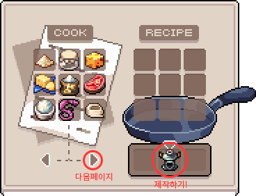
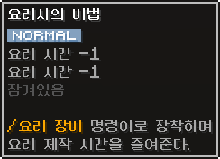
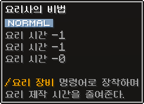

# 🫕 요리

다양한 요리를 만들어 판매할 수 있습니다.

### **요리 방법**

1. **레시피 확인**
   * 먼저 만들고 싶은 요리의 레시피를 확인합니다.
   * 명령어: `/레시피`
2. **레시피 구매**
   * 원하는 요리의 레시피를 아직 배우지 않았다면, `요리 상점` 에서 구매해야 합니다. (레시피는 일반적으로 한 번 구매하면 영구적으로 사용 가능합니다.)
3. **재료 준비 및 보관**
   * 레시피에 필요한 재료들을 모읍니다. (채집, 농사, 낚시, 사냥, 구매 등)
   * 준비된 재료를 가마솥에 넣습니다.
   * 명령어: `/요리 재료` 또는 `/요리 가마솥`
4.  **요리 시작**

    * 재료가 준비되면 요리 제작 UI를 엽니다.
    * 명령어: `/요리`
    * 만들고자 하는 요리를 선택한 후, '제작하기' 버튼을 클릭합니다.

    
<figure><figcaption>
'/요리' 명령어 실행 시 나타나는 UI
</figcaption></figure>

5. **제작 확인**
   * 제작을 시작하면 채팅창에 '숫자를 입력하시오' 메세지가 뜹니다.
   * 만들려는 **요리 숫자**를 채팅창에 입력합니다.
6. **요리 완료**
   * 요리가 완성되면 알림이 표시됩니다.
   * 완성된 요리는 요리 전용 가방에서 꺼내면 끝입니다.
   * 명령어: `/요리 가방`

***

### **요리 장비: 요리사의 비법**

요리 시간을 줄여줍니다.

* `요리 상점 NPC 하루토`를 우클릭하여 기본 `요리사의 비법`을 얻을 수 있습니다.
*   처음 획득 시 2줄의 슬롯을 가집니다.

    
<figure><figcaption>
요리사의 비법 (Cook's Secret Recipe Book)
</figcaption></figure>

    
<figure><figcaption>
기본 슬롯 2칸
</figcaption></figure>

*   **슬롯 확장**

    * `잠금 해제 열쇠` 아이템을 사용하여 `요리사의 비법` 슬롯을 확장할 수 있습니다.
    * **일반 잠금 해제 열쇠:** 사용 시 **30% 확률**로 슬롯 한 줄 확장 성공.
    * **고급 잠금 해제 열쇠:** 사용 시 **100% 확률**로 슬롯 한 줄 확장 성공.

    
<figure><figcaption>
잠금 해제 열쇠
</figcaption></figure> <figure><figcaption>
고급 잠금 해제 열쇠
</figcaption></figure>

    
<figure><figcaption>
열쇠로 슬롯 확장된 모습
</figcaption></figure>

***

### **요리사의 비법 강화**

`요리사의 비법`에 효과를 강화할 수 있습니다.

* `미스테리 큐브`, `어센틱 큐브` 등을 사용합니다.
*   **강화 방법:**

    1. 강화에 사용할 **큐브 아이템**을 손에 듭니다.
    2. 큐브를 들고 **우클릭**하면 강화 전용 UI가 열립니다.

    
<figure><figcaption></figcaption></figure>

