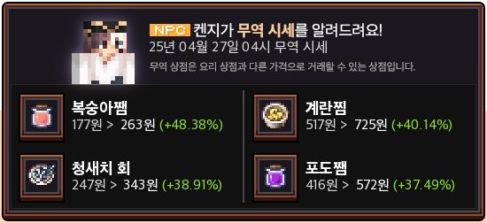

# 🚢 무역

### **무역 상인 켄지**

<mark style="background-color:orange;">**매 정각마다 낚시터**</mark>에서 켄지가 요리를 <mark style="background-color:orange;">**낮거나 높은 가격에 매입**</mark>합니다.\
<mark style="background-color:orange;">**5분간 매입**</mark>하며, 시간이 지나면 매입하지 않습니다.\
매 시간마다 가격은 달라지고, 한 요리당 <mark style="background-color:orange;">**판매할 수 있는 갯수는 1,000개**</mark>입니다. <mark style="color:red;">(다른 유저가 특정 요리를 1,000개 판매했을 경우 당일 그 요리는 매입하지 않습니다.)</mark>

### **무역 알림**

무역 알림은 뱃고동 소리와 함께 <mark style="background-color:orange;">**서버 채팅창에 알림**</mark>이 뜨고, <mark style="background-color:orange;">**디스코드 서버알림**</mark>에서 가장 높은 가격에 매입하는 4가지 요리를 알려드립니다.

<figure><figcaption>
무역 시세 알림 예시
</figcaption></figure>
