# 🐟 낚시

낚시는 <mark style="background-color:red;">**낚시터에서만**</mark> 가능합니다.

***

### **낚시 미니게임**

1. 낚싯대를 던지고 기다리면 물고기가 미끼를 뭅니다.
2. 물고기가 걸리면 화면에 낚시 바가 나타납니다.
3. <mark style="background-color:blue;">WASD 키 중 하나</mark>를 반복해서 눌렀다 떼어, <mark style="background-color:blue;">움직이는 표시를 중앙의 녹색 영역에 유지</mark>시키세요.
4. 표시가 <mark style="color:red;background-color:red;">양쪽 끝의 빨간색 영역</mark>에 닿으면 낚시에 실패합니다.
5. 성공적으로 녹색 영역에 표시를 유지하면 물고기를 낚아 올립니다.

<figure><figcaption>
낚시 미니게임
</figcaption></figure>

***

### **물고기 등급 확률**

낚이는 물고기의 등급은 확률에 따라 결정됩니다.

<figure>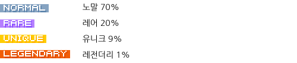<figcaption></figcaption></figure>

### **물고기 크기**

잡은 물고기의 크기는 등급에 따라 기본 범위가 정해지며, 특정 조건에 따라 추가 보너스를 받을 수 있습니다.

**1. 등급별 기본 크기 범위**

* **노말 :** 10cm \~ 30cm
* **레어 :** 20cm \~ 200cm
* **유니크 :** 150cm \~ 400cm
* **레전더리 :** 200cm \~ 1000cm

**2. 크기 보너스**

* **미니게임 성공 보너스 :** 미니게임 중 표시를 녹색 칸에 정확히 맞추면 크기 <mark style="background-color:blue;">+20cm \~ 50cm</mark> 증가
* **미끼 사용 보너스 :** 낚시용 지렁이 미끼를 장착하고 낚시하면 크기 <mark style="background-color:blue;">+5cm \~ 15cm</mark> 증가
* **바다의 행운 인챈트 :**
  * 낚싯대에 부여된 '바다의 행운' 인챈트 레벨에 따라 크기가 추가로 증가합니다.
  * 증가량: `[1과 (2 * 인챈트 레벨) 사이의 랜덤 정수] * 인챈트 레벨` 만큼 cm 증가
  * _예시: 바다의 행운 III (레벨 3) 이라면, 1과 (&#x32;_&#x33;)=6 사이의 랜덤 정수(1, 2, 3, 4, 5, 6 중 하나)를 뽑아 3을 곱한 값만큼 크기가 증가합니다. (최소 +3cm, 최대 +18cm)\*

***

### **획득 경험치**

물고기를 성공적으로 낚으면 '낚시 경험치'를 얻습니다. 획득량은 물고기의 등급과 크기, 그리고 인챈트에 따라 달라집니다.

**1. 등급 및 크기 기반 경험치** _(소수점 이하 버림)_

* **노말:** `[잡은 물고기 크기(cm) / 9]` 만큼 경험치 획득
* **레어:** `[잡은 물고기 크기(cm) / 8]` 만큼 경험치 획득
* **유니크:** `[잡은 물고기 크기(cm) / 7]` 만큼 경험치 획득
* **레전더리:** `[잡은 물고기 크기(cm)]` 만큼 경험치 획득 (크기만큼 그대로 획득)

**2. 증폭 인챈트 효과**

* 낚싯대에 부여된 '증폭' 인챈트 레벨에 따라 최종 획득 경험치가 증가합니다.
* 최종 경험치 = `기본 경험치 * (1 + (0.05 * 증폭 인챈트 레벨))`
* _예시: 증폭 II (레벨 2) 이고 기본 경험치가 100이라면, 최종 경험치는 100 \* (1 + (0.05 \* 2)) = 100 \* 1.1 = 110 EXP가 됩니다._

***

### **낚시터 계절 및 날씨**

낚시터에는 시간대에 따라 <mark style="background-color:blue;">여름과 겨울</mark> 계절이 적용되며, 다양한 날씨(<mark style="background-color:blue;">맑음, 비, 눈, 폭풍</mark>)가 나타납니다. 계절과 날씨는 낚이는 물고기 종류에 영향을 줍니다.

**1. 시간대별 계절**

* **00:00 \~ 06:00:** 여름
* **06:00 \~ 12:00:** 겨울
* **12:00 \~ 18:00:** 여름
* **18:00 \~ 24:00:** 겨울

**2. 날씨 발생**

* **비/눈:** 약 <mark style="background-color:blue;">35% 확률</mark>로 발생합니다.
* **폭풍:** <mark style="background-color:blue;">랜덤</mark>하게 발생합니다.
* <mark style="color:red;background-color:red;">폭풍우가 몰아칠 때는 더 큰 물고기가 잡힐 확률이 높아집니다!</mark>

**3. 날씨별 출현 물고기**

각 날씨 조건에서만 잡을 수 있는 특별한 물고기들이 있습니다.

<mark style="background-color:green;"><strong>모든 날씨</strong></mark> - 항상 잡힐 수 있는 물고기

<figure><figcaption></figcaption></figure>

<figure><figcaption></figcaption></figure>

<figure><figcaption></figcaption></figure>

<figure>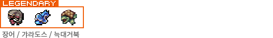<figcaption></figcaption></figure>

<mark style="background-color:yellow;"><strong>맑음</strong></mark> - 맑은 날에만 추가로 잡히는 물고기

<figure>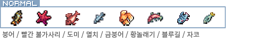<figcaption></figcaption></figure>

<figure>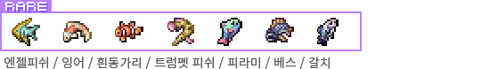<figcaption></figcaption></figure>

<figure><figcaption></figcaption></figure>

<figure><figcaption></figcaption></figure>

<mark style="background-color:blue;"><strong>비</strong></mark> - 비 오는 날에만 추가로 잡히는 물고기

<figure>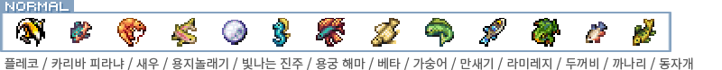<figcaption></figcaption></figure>

<figure>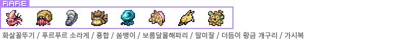<figcaption></figcaption></figure>

<figure><figcaption></figcaption></figure>

<figure>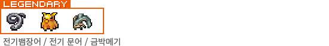<figcaption></figcaption></figure>

<mark style="background-color:red;"><strong>눈</strong></mark> - 눈 오는 날에만 추가로 잡히는 물고기

<figure>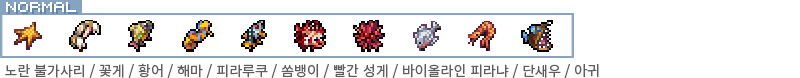<figcaption></figcaption></figure>

<figure>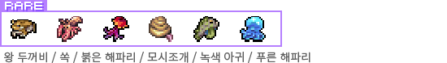<figcaption></figcaption></figure>

<figure>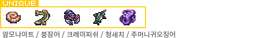<figcaption></figcaption></figure>

<figure>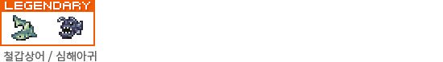<figcaption></figcaption></figure>

