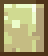
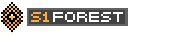

# 🐟 낚시

**낚시는&#x20;**<mark style="background-color:red;">**낚시터에서만**</mark>**&#x20;가능합니다**

### 🎮**미니게임**🎮

물고기를 찌를 물면 미니게임이 시작됩니다. \
낚시 바가 뜨면 wasd 중 하나를 눌렀다 떼었다 하며 중앙에 맞추면 성공! <mark style="color:red;">빨간색으로 가면 실패!!</mark>

<figure><figcaption></figcaption></figure>

### ⚖️**물고기 등급 확률**⚖️

<figure><figcaption></figcaption></figure>

### 🐟**물고기 크기**🐟

▫️노말 10\~30cm / 레어 20\~200cm / 유니크 150\~400cm / 레전더리 200\~1000cm\
▫️초록색 칸에 맞출 시 +20\~50cm \
▫️낚시용 지렁이 (미끼) 장착 시 +5\~15cm\
▫️바다의 행운 \[(1\~(2 x 바다의 행운 인첸트 레벨)) x 바다의 행운 인첸트 레벨] 만큼 증가

### 🌟획득 **경험치**🌟

▫️노말: \[잡은 물고기 크기/9] 만큼 낚시 경험치 획득\
▫️레어: \[잡은 물고기 크기/8] 만큼 낚시 경험치 획득\
▫️유니크: \[잡은 물고기 크기/7] 만큼 낚시 경험치 획득\
▫️레전더리: \[잡은 물고기 크기] 만큼 낚시 경험치 획득\
▫️증폭 \[경험치 x (1 + (0.05 x 증폭 인첸트 레벨))] 만큼 낚시 경험치 추가

### ☀️**계절 & 날씨**☀️

낚시터 계절은 여름과 겨울이 있고 날씨는 맑음, 비, 눈, 폭풍이 옵니다

**0\~6시 / 12\~18시** 여름  ㅣ  **6\~12시 / 18\~24시** 겨울

35% 확률로 눈과 비가 오고, 폭풍은 랜덤으로 옵니다! <mark style="color:red;">(폭풍이 올 때 더 큰 물고기가 잡힙니다)</mark>

날씨에 따라 잡히는 물고기가 다르게 나옵니다

<mark style="background-color:green;">**모든 날씨**</mark>

<figure><figcaption></figcaption></figure>

<figure><figcaption></figcaption></figure>

<figure><figcaption></figcaption></figure>

<figure><figcaption></figcaption></figure>

<mark style="background-color:yellow;">**맑음**</mark>

<figure><figcaption></figcaption></figure>

<figure><figcaption></figcaption></figure>

<figure><figcaption></figcaption></figure>

<figure><figcaption></figcaption></figure>

<mark style="background-color:blue;">**비**</mark>

<figure><figcaption></figcaption></figure>

<figure><figcaption></figcaption></figure>

<figure><figcaption></figcaption></figure>

<figure><figcaption></figcaption></figure>

<mark style="background-color:red;">**눈**</mark>

<figure><figcaption></figcaption></figure>

<figure><figcaption></figcaption></figure>

<figure><figcaption></figcaption></figure>

<figure><figcaption></figcaption></figure>

