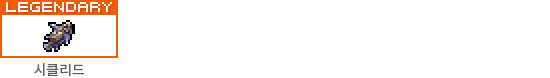

# 🏆 티어

티어 정산은 <mark style="background-color:yellow;">**3개월마다 진행**</mark>합니다.
\
1, 4, 7, 10월 1일 00:00 \~ 00:10 <mark style="background-color:yellow;">**정산 시간을 10분**</mark> 소요됩니다.
\
<mark style="background-color:yellow;">**레벨이 초기화**</mark> 되며, 각 컨텐츠별 레벨 순위에 따라 <mark style="background-color:yellow;">**뱃지와 보상이 지급**</mark>됩니다.

### **보상**

* 1위 - **1,000타마 / 오오라**
* 2\~5위 - **600타마**
* 상위 10% - **300타마**
* 상위 30% - **150타마**
* 6레벨 이상 - **50타마**

순위에 오른 모두에게 <mark style="background-color:yellow;">**등급 이름 뱃지**</mark>를 지급합니다.

### **시즌1 뱃지**

채집 등급 뱃지

<figure><figcaption></figcaption></figure> <figure><figcaption></figcaption></figure> <figure><figcaption></figcaption></figure> <figure><figcaption></figcaption></figure>

채광 등급 뱃지

<figure><figcaption></figcaption></figure> <figure><figcaption></figcaption></figure> <figure><figcaption></figcaption></figure> <figure><figcaption></figcaption></figure>

벌목 등급 뱃지

<figure><figcaption></figcaption></figure> <figure><figcaption></figcaption></figure> <figure><figcaption></figcaption></figure> <figure><figcaption></figcaption></figure>

낚시 등급 뱃지

<figure><figcaption></figcaption></figure> <figure><figcaption></figcaption></figure> <figure><figcaption></figcaption></figure> <figure><figcaption></figcaption></figure>

농사  등급 뱃지

<figure><figcaption></figcaption></figure> <figure><figcaption></figcaption></figure> <figure><figcaption></figcaption></figure> <figure><figcaption></figcaption></figure>

