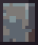

# 🎚️ 매직스톤

<figure><figcaption>
매직스톤
</figcaption></figure>

각 컨텐츠 활동 시 <mark style="background-color:blue;">**일정 확률로 매직스톤이 등장**</mark>합니다.

### **등장 확률**

* 채집 **0.05%**
* 채광 **0.05%**
* 벌목 **0.05%**
* 낚시 **0.3%**
* 농사 **0.0005%**

### **종류**

<figure><figcaption>
빛바랜 매직스톤
</figcaption></figure> <figure><figcaption>
네더 매직스톤
</figcaption></figure> <figure><figcaption>
엔더 매직스톤
</figcaption></figure> <figure><figcaption>
황금 매직스톤
</figcaption></figure>

매직스톤을 우클릭하여 부수면\
빛바랜 매직스톤 **60%**, 네더 매직스톤 **36%**, 엔더 매직스톤 **3%**, 황금 매직스톤 **1%** 확률로 등장한다.

* **빛바랜 매직스톤**
  * <mark style="background-color:blue;">**60% 확률로 등장**</mark>한다.
  * 빛바랜 매직스톤 <mark style="background-color:blue;">**10개를 들고 우클릭**</mark>하면 <mark style="background-color:blue;">**매직스톤으로 바뀐다.**</mark>
* **네더 매직스톤**
  * <mark style="background-color:blue;">**36% 확률로 등장**</mark>한다.
  * 네더 월드에서 채집할 수 있다.
* **엔더 매직스톤**
  * <mark style="background-color:blue;">**3% 확률로 등장**</mark>한다.
  * 엔더 월드에서 채집할 수 있다.
* **황금 매직스톤**
  * <mark style="background-color:blue;">**1% 확률로 등장**</mark>한다.
  * 황금 밀밭에서 <mark style="background-color:blue;">**30초 동안**</mark> 밀을 캘 수 있다.
  * 황금 밀밭에서는 <mark style="background-color:blue;">**많은 경험치와 금빛 밀**</mark>을 얻을 수 있다.

