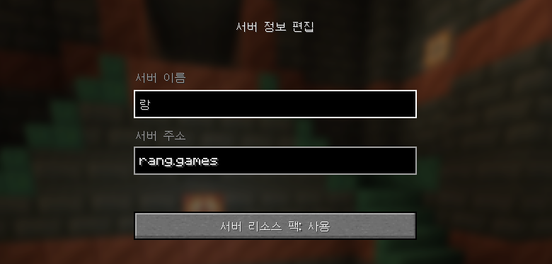

# 🗃️ 리소스팩

### **리소스팩이 적용되지 않아요.**

* 서버 정보 편집 확인하기
  * 서버 접속 전에 서버 리소스 팩을 사용으로 설정 후 접속해주세요.

<figure><figcaption></figcaption></figure>

* 서버 리소스팩 폴더 정리하기
  * **%Appdata% > .minecraft > server-resource-packs**
  * 해당 폴더 또는 해당 경로에 들어있는 모든 파일을 삭제 후에 다시 접속해주세요.
  * 안에 있는 파일은 서버 리소스팩 저장 파일이라서 삭제해도 문제되지 않습니다.

### **HUD가 화면 중앙으로 올라와있어요.**

* forge 모드가 설치되어 있는지 확인하기
  * forge 모드가 적용되어 있는 경우 해당 현상이 발생 합니다.
  * forge 모드가 적용되지 않은 기본 클라이언트로 접속하시면 해당 문제가 해결됩니다.

### **글씨가 빨간색 또는 검정색으로 보여요.**

* 기본 클라이언트 사용하기
  * 사용중인 쉐이더나 리소스팩의 문제일 가능성이 높으므로 적용중인 쉐이더와 리소스팩을 해제하시면 해당 문제가 해결됩니다.
* 페더 클라이언트의 경우
  * 페더 클라이언트 설정 > 성능에 있는 Nametag Optimization의 적용을 **해제**하시면 해당 문제가 해결됩니다.

