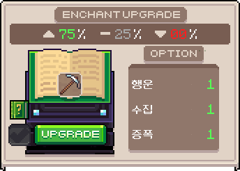
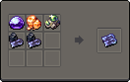

# 📖 인첸트

강화 제작소에서 여러 도구를 인첸트할 수 있습니다.\
기본 도구는 15강까지 인첸트 가능하며, 제련된 소달라이트로 도구 강화를 하면 20강까지 인첸트 가능합니다.

<figure><figcaption>
인첸트 강화
</figcaption></figure>

### **인첸트 방법**

* 도구에 <mark style="background-color:blue;">인첸트 등록</mark>을 한다.
  * 바닐라 경험치 1,000EXP를 사용하여 <mark style="background-color:blue;">랜덤한 인첸트 3개를 등록</mark>할 수 있다.
  * 강화를 하지 않으면 언제든 다시 등록할 수 있습니다.
* 원하는 인첸트가 나오면 인첸트 강화를 합니다.
  * 1번마다 인첸트  레<mark style="background-color:blue;">벨\*500EXP 와 인첸트레벨\*500랑이 소모</mark>됩니다.
  * 인첸트 등록이 완료된 아이템만 강화가 가능하며, <mark style="background-color:blue;">성공 시 랜덤한 옵션이 +1</mark>되고 <mark style="background-color:blue;">하락 시 제일 높은 옵션이 -1</mark>     됩니다.
  * <mark style="color:red;">인첸트 3개의 합이 8이상부터 하락확률이 발생합니다.</mark>
* 강화 하락권 사용 시 <mark style="background-color:blue;">업그레이드 버튼 옆 체크표시를 활성화</mark> 한 후 업그레이드를 합니다.
  * 15단계 이하 도구는 하급 하락권을 20단계 이하 도구를 강화 시 중급 하락권을 사용합니다.
* 원하는 인첸트 레벨이 올라가지 않았을 때 인첸트 재분배를 할 수 있습니다.
  * 바닐라 경험치 15단계 이하 <mark style="background-color:blue;">인첸트 레벨 \* 1,000EXP</mark> / 20단계 이하 <mark style="background-color:blue;">인첸트 레벨 \* 2,000EXP</mark> / 30단계 이하 <mark style="background-color:blue;">인첸트 레벨 \* 4,000EXP</mark> 필요합니다.
  * <mark style="background-color:blue;">인첸트 티켓</mark>을 이용해서 재분배 가능합니다.

### **커스텀 인첸트 목록**

인첸트 등록 시 등록되는 커스텀 인첸트의 <mark style="background-color:blue;">확률은 바닐라 인첸트와 동일</mark>합니다.

**행운**

* 도구에 맞는 활동 시 \[(행운 인첸트 레벨/5+1)\~(행운 인첸트 레벨+1)] 만큼 갯수를 얻으며, 계산 중 (행운 인첸트 레벨/5)은 소수점을 버립니다.\
  ex) 행운 인첸트 14레벨일 경우 14/5 = 2.8이므로, 소수점을 버리면 2, 결과적으로 3\~15개를 얻게 됩니다.

​

**증폭**

* 도구에 맞는 활동 시 \[경험치x(1+(0.05x증폭 인첸트 레벨))] 만큼 추가로 도구에 맞는 컨텐츠 경험치를 얻습니다.\
  ex) 획득 컨텐츠 경험치가 10이고 증폭 인첸트 5레벨일 경우 10x1.25=12.5만큼 추가로 컨텐츠 경험치를 얻습니다.

​

**수집**

* 채광 시 \[(수집 인첸트 레벨+4)/6400]확률로 \[(0\~150)x수집 인첸트 레벨] 만큼 랑을 획득합니다.\
  ex) 랜덤 값이 100이고 수집 인첸트 5레벨일 경우 9/6400확률로 500만큼 랑을 획득합니다.
* 농작물 수확 시 \[(수집 인첸트 레벨+4)/32000]확률로 \[(0\~150)x수집 인첸트 레벨] 만큼 랑을 획득합니다.\
  ex) 랜덤 값이 100이고 수집 인첸트 5레벨일 경우 9/32000확률로 500만큼 랑을 획득합니다.
* 낚시 성공 시 1% 확률로 \[​낚은 물고기 크기x(수집 인첸트 레벨/2)] 만큼 랑을 획득합니다.\
  ex) 낚은 물고기 크기가 100이고 수집 인첸트 10레벨일 경우 1%확률로 500만큼 랑을 획득합니다.

​

**바다의 행운**

* 낚시 시 200cm 이상 물고기의 크기가 ​\[(1\~(2x바다의 행운 인첸트 레벨))x바다의 행운 인첸트 레벨] 만큼 증가합니다.\
  ex) 바다의 행운 인첸트 5레벨일 시 200cm 이상 물고기의 크기가 (1\~10)x5만큼 증가합니다.

소달라이트 강화

15단계 인첸트 도구를 제련된 소달라이트로 강화하여 소달라이트 도구를 만들 수 있다.

제련된 소달라이트 만드는 방법

<figure><figcaption></figcaption></figure>

